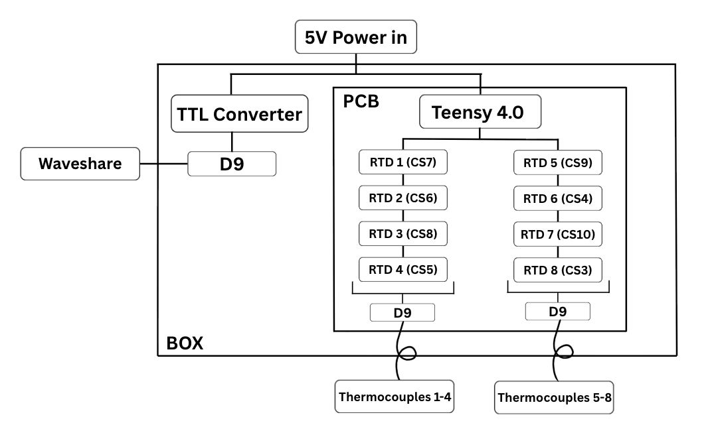
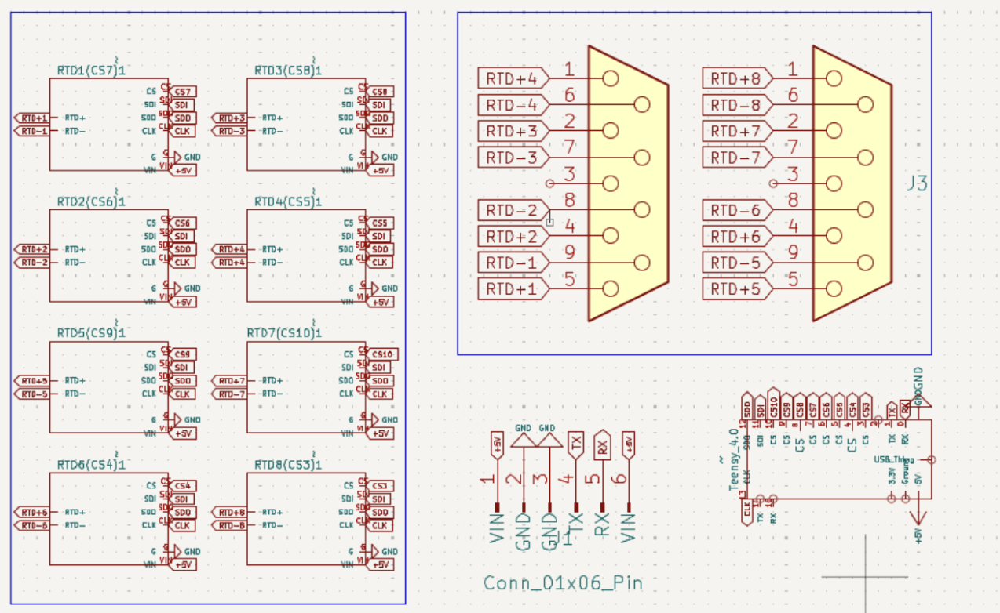
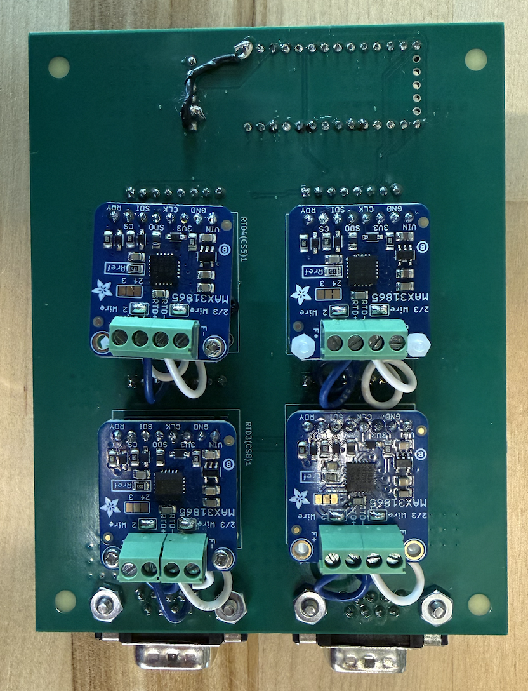
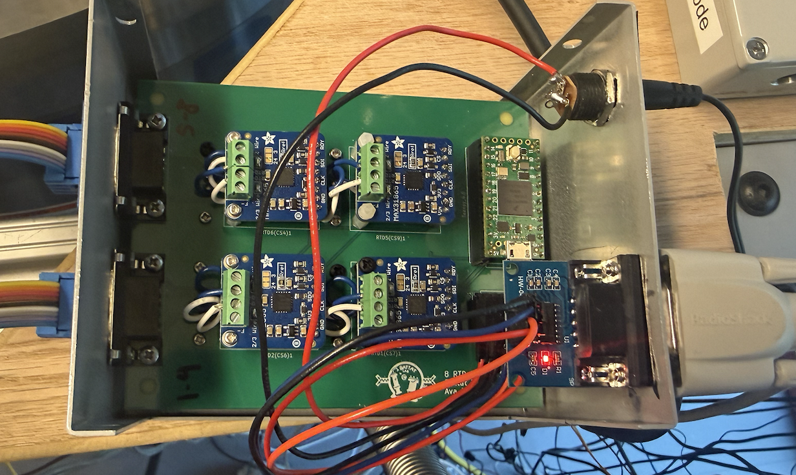
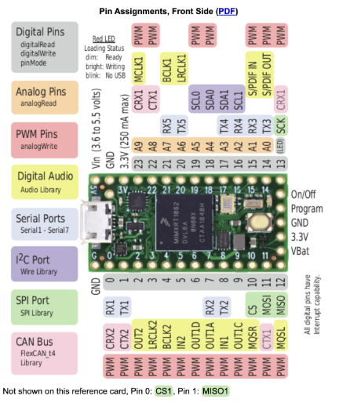
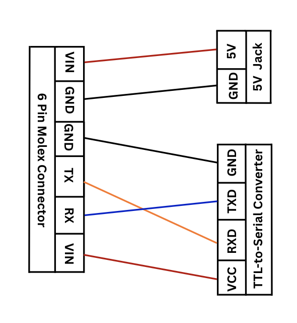

# 8-channel RTD Readout Board with Serial Communication
Design and implementation of an 8-channel RTD readout

# Overview
This project is an 8-channel temperature readout system designed around a teensy 4.0 microcontroller. The custom PCB connects the 8 RTD boards to two D9 connectors, which each route to four temperature sensors each.

The teensy controls communication with the 8 RTD chips, requesting resistance values and calculating temperature values when given the command 't'. A six pin Molex connector on the PCB is wired to an external 5V power supply and a TTL-to-serial converter. The 5V power supply powers the entire board, and the TTL-to-serial converter connects to a Waveshare device. 

The communicaton is:
1. The Waveshare sends a [command](#commands) to the teensy.
2. The Teensy requests a reading from all 8 RTD boards.
3. The Teensy calculates temperature from the readings and sends the data back to the Waveshare.
4. The Waveshare sends the data to the host computer.

This system allows for remote monitoring of 8 temperature channels.

# System Diagram

# Schematic 

# Known Issue
*Board will not function without this fix*

For PCB v2, one ground net connection is missing and must be manually wired. Fix: Connect G pin of Teensy to the ground pins of the 6 pin Molex connector (U1). Shown below.

# Hardware Components

| Component | Function |
| :--- | :--- |
| Teensy 4.0 | Microcontroller | 
| Custom RTB PCB | allows communication between Teensy, 8 RTDs, and Waveshare, See: [Fab Files](Hardware/PCB%20v2/Fab%20Files/)| 
| RTDs + thermocouples | 8 temperature sensors | 
| TTL-to-Serial Converter | communication interface to Waveshare  | 
| Waveshare | external controller | 
| Custom enclosure | houses all electronics and wiring | 
| 5V power supply | powers entire system | 

See [BOM](Hardware/bom.md) for component details.

# Assembly Instructions
1. Upload [Teensy Code](Software/TeensyCode/EightRTDBoard_05052026.ino) to Teensy 4.0.
2. Populate PCB. *If using v2 PCB, make sure you perform fix detailed in [Known Issue](#known-issue)*
5. [Wire 6 pin molex connection](#wiring). See: [TTL-to-Serial and 5V to PCB Wiring](#ttl-to-serial-and-5v-power-jack-to-pcb)
6. [Mount electronics in enclosure](#ttl-to-serial-to-PCB)
7. Connect Waveshare Device to TTL-to-Serial converter via D9-to-D9 1 to 1 connector.
8. Close enclosure.

# Enclosure Layout

Enclosure has cutouts for 3 D9 connections and for the 5V Power Jack.
## Front Panel
| Component | Function |
| :--- | :--- |
| 5V Power Jack | power input | 
| D9 #1 | TTL-to-Serial communication interface | 

## Back Panel
| Component | Function |
| :--- | :--- |
| D9 #2 | thermocouple to RTDs 1-4 connection | 
| D9 #3 | thermocouple to RTDs 5-8 connection | 

# Teensy Pinout

# Wiring
## TTL-to-Serial and 5V Power Jack to PCB

## RTD Connections

| RTD | CS Pin | D9 | D9 Pin to RTD+ | D9 Pin to RTD- |
| :--- | :--- | :--- | :--- | :--- |
| 1 | 7 | 1 | 5 | 9 |
| 2 | 6 | 1 | 4 | 8 |
| 3 | 8 | 1 | 2 | 7 |
| 4 | 5 | 1 | 1 | 6 |
| 5 | 9 | 2 | 5 | 9 |
| 6 | 4 | 2 | 4 | 8 |
| 7 | 10 | 2 | 2 | 7 |
| 8 | 3 | 2 | 1 | 6 |

# Commands

| Command | Function |
| :--- | :--- |
| t | Read all 8 RTD channels and transmit temperature data to the Waveshare |
| d | For debugging. Sends measured resistance values for all 8 RTDs to the serial monitor of the teensy. |

# Potential Upgrades
Potential upgrades include:
1. Updating the teensy code with commands to request the temperature of a single RTD.
2. Fix the missing ground connection in v3 of the PCB.
3. Update the python code with a comprehensive GUI, including real time plots of the temperature data.
4. Add a debugging case across the serial connection so the resistance data is available outside of the Teensy serial monitor.
5. Create an alerting system for failed serial connection or disconnected sensors.
